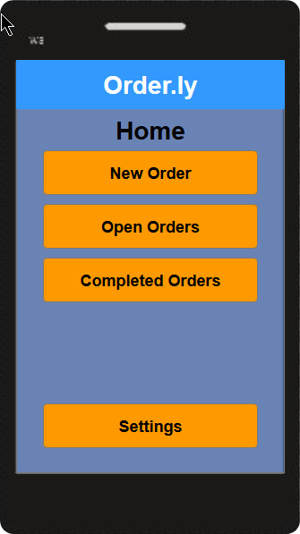

# CPSC 481 - Tutorial 2 - Group 5

## Order.ly

* Backend for a Restaurant Ordering System
* Abdul Farah (10160526), Marc-Andre Fichtel (30014709)
* Tutorial: #2, TA: Kody Dillman

## Project Idea

Restaurants have one of the busiest and most fast-paced work environments in the food industry. We wanted to create an application to assist restaurant workers and ensure their job goes as smoothly as possible. We learned a lot about how restaurants really work, and how hard their job can sometimes be. Using what we learned, we attempted to make an application that will tend to our users’ needs. The step-by-step process of coming up with ideas and bringing them to life was an enriching and invaluable experience.
