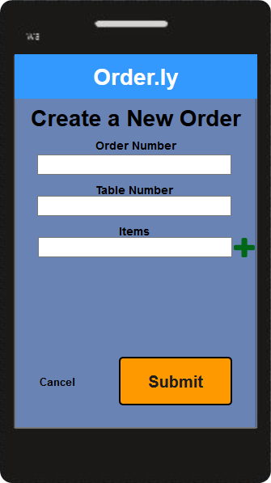
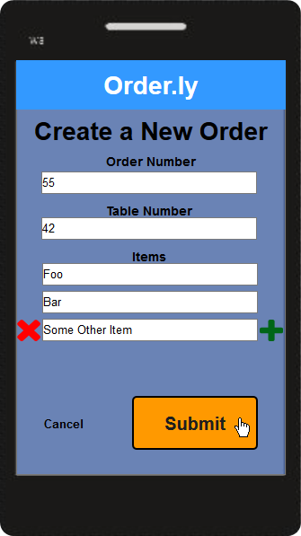
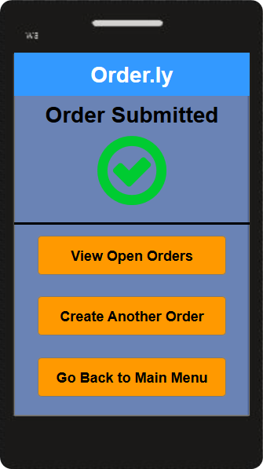
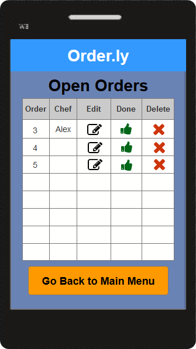
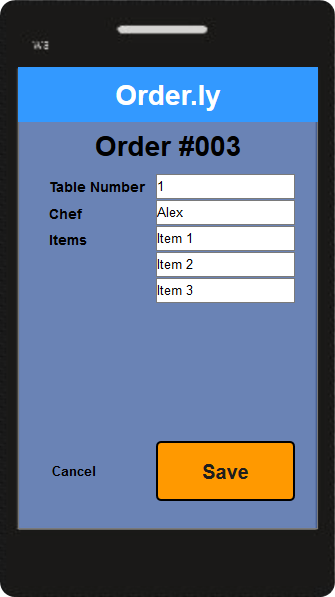
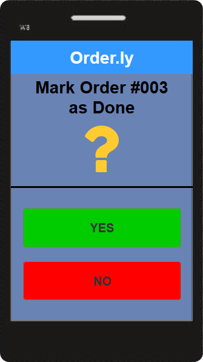
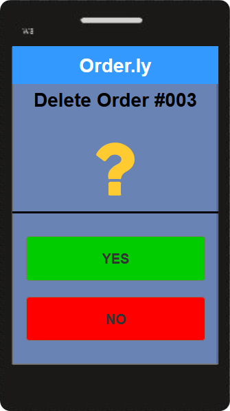
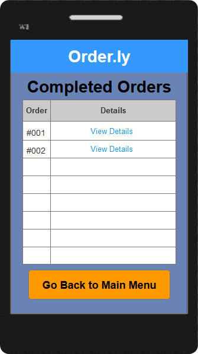
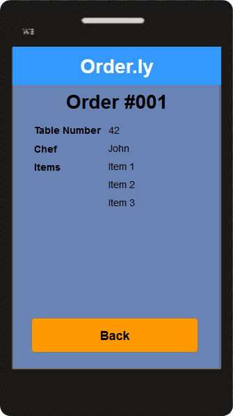

# P3: Hi-fi Prototypes and Heuristic Evaluation
(Note: Numbers and bullet points for ordered and unordered lists do not seem to render properly on the github.io page)

## Link to Demo System

[Demo system](http://tr8dwv.axshare.com/)

## Description of implementation
 
The main idea of the system we have designed is to enable restaurants to manage their orders through it. That means that the system should be involved at every step in the lifetime of an order: Creation, Processing, and Completion. An order is usually one of several that all belong to one group of people eating at the restaurant, so the system must be prepared to deal with orders in terms of customer groups - in this specific case, a group of customers is assumed to belong to a table. Another consideration is that an order’s lifetime takes place in various locations - a waiter takes an order from customers at their table, a chef processes it, and a waiter marks it as done once delivered. In order to (no pun intended) accommodate to this, and make the it as easily accessible as possible, we chose to make the system as a mobile application for smartphones.

## Design Requirements
 
The system must fulfill essential tasks related to orders (creation, processing, completion). This leads to some essential requirements: 
1. Creating orders and doing so quickly (customers do not like to wait) by recording any number of items for a given table
2. Editing or deleting open orders (customers like to change their mind)
3. Displaying open orders (and their details) in a chronological list (oldest orders should be at the top)
4. Assigning orders to chefs (so that everyone knows who is taking care of which order)
5. Being able to mark orders as done, and viewing completed orders and their details
 
Additional requirements that could be presented in more sophisticated future prototypes include things such as menu management, generating and viewing reports about orders in the past (for business intelligence purposes, i.e. how many completed and deleted orders were recorded this month vs the previous?), marketing tools such as newsletter management, and additional input methods to increase the app’s accessibility for older users, or those with physical disabilities. A preview of these features can be seen in the current prototype in the form of buttons, but no functionality exists towards these additional requirements. 

## Justifications for design decisions
 
The design choices seen in the system were made with several key focus points in mind. One consideration to keep in mind is that we think of the system as a productivity tool - it should increase order management speed and decrease mistakes, and design choices were made predominantly to accommodate these needs first.
- Buttons are especially large and oriented vertically, because the app should cater towards people who are either older or less familiar with smartphone technology. Prominent buttons with simple and intuitive wordings placed in a vertical layout decrease the likelihood of both motor-control slips and cognitive mistakes. 
- Any functionality that is not directly related to orders has been grouped away under settings. This will speed up order-related tasks and decrease likelihood of slips and mistakes, all the while keeping the layout clean and tidy.
- Primary call to actions are displayed in such a way that they pop from the rest of the page. Primary CTA’s are the most important buttons of the system, and so should be easy to find and press.
- When creating an order, multiple items can be added by displaying additional text fields with a green plus icon. We changed this from the previous design, where additional text fields were enabled as soon as the above text field was focused. The latter design promoted speed at the cost of clarity, but we found that too much clarity was being sacrificed, especially with regards to older / less technically savvy users.
- When creating an order, a red delete icon is displayed and can be used to remove extra text fields, if there are more than two text fields (i.e. all but the first one can be removed). This was done to give users the ability to quickly remove a wrong item, rather than having to manually erase the text from the text field.
- Open orders are shown in a compact table (at a trade off for white space) in order to increase clarity. Also, actions users can take on orders are shown as color coded icons. Using icons will give users a better visual clue as to what each action does, and in return reduce cognitive mistakes. To reinforce this, the header of each column describes the action in text form. The colors chosen (black for editing an order, green for marking an order as done, red for deleting an order) may not be suitable with users with color blindness, but the chosen colors adhere to a standard that most users will be familiar with. 
- Completed orders are shown in a similar table, but all details are hidden  on another page in order to ensure clarity and avoid cluttering the page. We suspect that completed order details will be less used than other information, so hiding these details away should not impact users’ experience in a negative way.
- Each page displays a large header that lets users know where in the app they are at that point. This should serve to avoid confusion among new users.
- Order details include an assigned chef, so that kitchen staff can easily see who is processing which order, and which orders are not being processed at all, yet.

## Highlight Walkthrough

Let's look at the lifetime of an order in the context of the system.

### Hightlight 1: Order Creation

The first step in the life of an order is order creation. From the Home page, users can click 'New Order', which is the topmost button. This will bring them to a page that lets them create a new order. First, the order number must be entered. While this is likely unintuitive, and not a good design choice from a usability perspective, giving users the ability to assign order numbers manually could be used as a means of prioritizing especially important orders (through there are likely much better ways to achieve this). Next, the table number must be entered. Finally, order items can be specified. Depending on the number of items that the user wants to enter, he or she may add additional text fields with a green plus icon. Also, unwanted text fields can be removed with a red delete icon, which will be handy as a fast way to remove wrongly entered items. Once the user has entered all relevant details, the order can be submitted (i.e. saved and displayed in the Open Orders table), or canceled, in which case nothing is saved and the user is returned to the Home page. If an order is created, a confirmation page is shown with relevant follow-up options.

### Highlight 2: Open Order Management

When an order is created, it appears in the Open Orders table, which can also be navigated to from the Home page. Here, orders are sorted by order number. Note that since orders should auto-increment rather than having a user specify the order number during creation, this list would be sorted chronologically, with the oldest orders at the top. The next detail is an assigned chef who will process the order. This will help the kitchen staff stay oragnized and increase work speed. The next three columns in the table all relate to actions that can be taken on the orders in the list. Orders can be viewed & edited, marked as done, or deleted. These actions are shown as colorcoded icons for quick and easy seeing and pressing. The order details page shows an order's details, all of which appear in text fields that can be edited, except the order number (this number should not be easily changed as the sorting of the table depends on it - in a more sophisticated prototype an option to change this might be given with some kind of validation prompt, but for the sake of simplicity, we decided to not make this number editable). The bottom of this page gives users the options of either saving or discarding any changes they may have made. Note that in a more sophisticated prototype, these options should only appear once a change has been made (whereas otherwise a simple Back button should be displayed). Marking an order as done moves it from this table into the Completed Orders table, and deleting an order does just that.

### Highlight 3: Completed Orders

Finally, once an order has been marked as done, it appears in the Completed Orders table. Details can be viewed for completed orders, but not edited, as that wouldn't make much sense in the context of wanting to see what orders were processed. 

## Heuristic Evaluation Results

### Summary of Major Problems
 
The main usability problems uncovered during our individual heuristic evaluations are the following:
+ The table of open orders doesn’t offer enough details about each order, instead forcing users to open the Order Details page for each order they wish to look at. This problem was given a severity rating of 3, because it is a noticeable break in flow the app offers its users.
+ When creating orders, order numbers have to be entered manually. This makes little sense, as waiters would have to remember what order number is the next in line. We collectively gave this issue a severity rating of 3 to 4, because it disrupts app usage significantly, and does so frequently (i.e. every time a new order is created).
+ It is common practice for customers to specify special needs when ordering (i.e. what kind of toast to order). The system does not allow for orders to have comments, which should be possible. This could be fixed by adding an extra text field to the bottom of an order. We assigned this issue a severity rating of 4, because it seriously impedes common work procedures during order taking.
+ The app does not use platform-specific guidelines, but instead uses a design that is a compromise between all platforms. This is suboptimal, because users of either platform will not be fully satisfied with this design. This issue received a severity rating of 2, because it poses a noticeable, but minor annoyance, and comes at the benefit of having to create only one design for all platforms.
+ During order creation, items have to be typed in manually. This is tedious, and a lot of time could be saved here in the form of autocompletion. We gave this a severity rating of 2, because while this behavior is not as optimized as could be, it is very close to the reality of order taking, which happens manually, as well.

### Identified usability issues & potential fixes

The following issues and corresponding potential fixes were identified during the heuristic evaluations (ordered first by severity and then by heuristic violated):

| Heuristic Violated | Page | Description | Suggested Fix | Severity Rating |
|--------------------|------|-------------|---------------|-----------------|
| Flexibility and efficiency of use | Entire System | Orders cannot be given special instructions, which is usually a fairly common practice. | Let users add comments to orders. | 3 |
| Visibility of System Status | Open Orders | On the open orders screen, the chef is unable to see the details of the order, unless the edit button is pressed. | Add a details button next to each order on the open order screen or change the edit button to edit/view details. | 3 |
| Consistency & Standards | Entire System | The system does not use platform-specific standards. If the system runs on Android, it doesn’t utilize the Android ‘Back’ button. If the system runs on iOS, it doesn’t adhere to Apple standard design guidelines, either. | Implement platform specific versions of the system. | 2 |
| Recognition > Recall | New Order | When creating a new order, users have to remember menu item names (more of a limitation of the prototyping tool rather than the designer’s lack of thought). | Autocomplete suggestions should appear once the user starts typing. | 2 |
| Help & Documentation | Settings | The system does not contain a manual of some sort so that confused users may get help quickly. | Add a help manual to the settings page. | 2 |
| Flexibility and Efficiency of use | New Order | Order number has to be entered manually each time you’re creating a new order. This can waste a lot of time in the long run. | Order number should increment on its own. | 2 |
| Aesthetic & minimalist design | Home | The wording of the settings button is misleading, as the settings page contains extra functionality rather than settings. However, this was a conscious decision on the designers’ parts to better highlight the main features of the system. | Adjust the wording to be more inclusive of additional features. | 1 |
| Aesthetic & minimalist design | Order Done 1-3, Delete Order 1-3 | These pages have too many colours on them that are not found in these proportions anywhere else. | Redesign these pages to be more consistent. | 1 |
| Aesthetic and minimalist design | Home | Users might not be fluent in English, so options could be more obvious in what they do. | Add icons to each of the buttons in the main menu. | 1 |
| Aesthetic and minimalist design | Settings | Settings contains newsletters, which can be a bit confusing and unexpected. | Change settings to a more descriptive word. | 1 |
| Consistency & Standards | Entire System | Some pages have a go back button while new order has a cancel button. | Replace cancel with a go back button. | 1 |
| Consistency & Standards | Open Orders | Marking order as “done” sends it to completed orders. This can cause confusion for the user. | Change marking order as done to marking order as complete. | 1 |
| Flexibility and efficiency of use | New Order | Adding and removing a new item can be tedious at times on the create new order page. | Add some sort of swipe functionality to remove items. | 1 |

### Raw Heuristic Evaluation Notes

Please check [this collaborative Google Doc](https://docs.google.com/document/d/104wR3_X_sdpXarmn1DiRS_L2gkYvUDx40mrRtGsThg0/edit?usp=sharing) to find our individual heuristic analyses at the bottom of the page.
